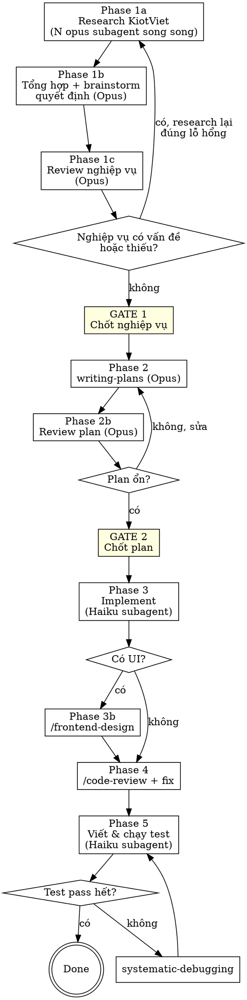

# Kiot Feature — Quy trình phát triển tính năng mới

## Overview

Hệ thống này build dựa trên **nghiệp vụ của KiotViet**. Mỗi tính năng mới đi qua 6 phase với **phân công model cố định theo phase** và các **gate xác nhận bắt buộc**.

**Nguyên tắc lõi:** Hiểu đúng nghiệp vụ KiotViet TRƯỚC khi viết một dòng code. Sai nghiệp vụ = build dở rồi vứt.

**User KHÔNG cần rành nghiệp vụ.** Hệ thống **tự nghiên cứu** cách KiotViet làm (web + codebase + `CLAUDE.md`) bằng các **research subagent chạy song song**, rồi tổng hợp và trình bày cho user quyết định scope — KHÔNG bắt user giải thích nghiệp vụ KiotViet.

**KHÔNG bỏ qua bất kỳ gate nào — kể cả tính năng "trông có vẻ đơn giản".**

## Phân công model theo phase (BẮT BUỘC)

| Phase | Việc | Model | Cách thực thi |
|-------|------|-------|---------------|
| 1a | **Tự research nghiệp vụ KiotViet (song song)** | **Opus** | Dispatch nhiều research subagent `model: opus` |
| 1b | Tổng hợp + brainstorm quyết định với user | **Opus** | Main session |
| 1c | Review lại nghiệp vụ | **Opus** | Main session |
| 2 | Viết implementation plan | **Opus** | Main session |
| 2b | Review plan | **Opus** | Main session |
| 3 | Implement code | **Haiku** | Dispatch subagent `model: haiku` |
| 3b | Vẽ UI (nếu có) | — | `/frontend-design` ở main session |
| 4 | Code review + fix bug | — | `/code-review` ở main session |
| 5 | Viết & chạy test | **Haiku** | Dispatch subagent `model: haiku` |

> Main session NÊN chạy ở Opus (brainstorm + plan là việc cần phán đoán cao). Research subagent (Phase 1a) và Implement/Test (Phase 3, 5) đều dispatch qua Agent tool với `model` tương ứng. Nếu main session chưa ở Opus, nhắc user `/model opus` trước khi bắt đầu Phase 1.

## Workflow

## Phase 1a — Tự research nghiệp vụ KiotViet (N opus subagent song song)

**REQUIRED SUB-SKILL:** Use `superpowers:dispatching-parallel-agents`

Announce: "Đang dispatch các research subagent để tự tìm hiểu nghiệp vụ KiotViet cho tính năng này..."

**Dispatch song song** nhiều research subagent (Agent tool, `model: "opus"`), mỗi agent một góc độc lập. Mỗi subagent được phép dùng `WebSearch`/`WebFetch` (tra cách KiotViet làm thật) **và** đọc codebase + `CLAUDE.md`. Bộ góc mặc định:

1. **Luồng nghiệp vụ & trạng thái** — KiotViet xử lý tính năng này thế nào: các bước, state machine, hành động chính/phụ.
2. **Dữ liệu & ràng buộc** — trường dữ liệu, validation, edge case, công thức (giá, tồn, công nợ...) KiotViet áp dụng.
3. **Phân quyền & luồng người dùng** — OWNER vs nhân viên làm được gì; đối chiếu bảng phân quyền trong `CLAUDE.md`.
4. **Tác động lên hệ thống hiện tại** — map vào schema/module sẵn có (Product, Customer, Inventory, Sales, Report); chỗ nào khớp, chỗ nào phải thêm bảng/cột; có đụng mục "Quyết định không làm" không.

Mỗi subagent trả về: tóm tắt nghiệp vụ KiotViet cho góc đó + nguồn (URL/đường dẫn file) + các điểm cần user quyết định.

> Điều chỉnh số góc theo độ phức tạp tính năng — tính năng nhỏ có thể 2 góc, lớn thì 4-5. Mỗi góc phải **độc lập** (không chia sẻ state) để chạy song song an toàn.

## Phase 1b — Tổng hợp + brainstorm quyết định (Opus, main session)

**REQUIRED SUB-SKILL:** Use `superpowers:brainstorming`

Gộp kết quả các research subagent thành một bức tranh nghiệp vụ KiotViet thống nhất. Sau đó dùng brainstorming để chốt **quyết định** với user — **không** bắt user giải thích nghiệp vụ. Trình bày dạng:

- "KiotViet làm thế này [tóm tắt]. Đề xuất của tôi cho hệ thống mình là [X] vì [lý do]."
- Chỉ hỏi user ở những **điểm cần quyết định** (scope, có làm phần này không, ưu tiên...), kèm **đề xuất mặc định** để user chỉ cần gật/sửa.
- Hỏi **từng câu một**, không gộp.

## Phase 1c — Review lại nghiệp vụ (Opus)

Tự review bản nghiệp vụ đã tổng hợp:
- Đầy đủ chưa? Có edge case nào KiotViet xử lý mà ta bỏ sót?
- Có mâu thuẫn với `CLAUDE.md` (schema, multi-tenant, soft-delete, kardex, giá vốn bình quân) không?
- Có vi phạm scope Phase 1 (mục "Quyết định không làm") không?
- Research có **lỗ hổng** (góc nào kết quả mỏng/không chắc) không?

**Nếu phát hiện vấn đề / thiếu / lỗ hổng → quay lại Phase 1a, dispatch research subagent mới nhắm đúng lỗ hổng đó**, rồi tổng hợp và review lại. Lặp tới khi nghiệp vụ sạch.

**GATE 1 — dừng bắt buộc:**
> "Nghiệp vụ KiotViet cho tính năng này tôi đã research như sau: [tóm tắt luồng + ràng buộc + phân quyền + tác động + nguồn]. Các điểm đã chốt: [...]. Xác nhận để viết plan không?"

KHÔNG sang Phase 2 cho tới khi user xác nhận rõ ràng.

## Phase 2 — Viết plan (Opus)

**REQUIRED SUB-SKILL:** Use `superpowers:writing-plans`

Announce: "Đang dùng writing-plans để lên implementation plan..."

Plan lưu ở `docs/superpowers/plans/YYYY-MM-DD-<feature>.md`. Plan phải phản ánh đúng nghiệp vụ đã chốt ở Phase 1 và tuân thủ các pattern bắt buộc trong `CLAUDE.md` (tenant isolation, audit log, price history, migration checklist).

## Phase 2b — Review plan (Opus)

Đọc lại plan vừa viết, tự kiểm:
- Mỗi bước có khớp nghiệp vụ đã chốt không?
- Có đủ: Alembic migration, partial unique index, filter `tenant_id`, ghi `audit_logs`, `require_role`, test tenant isolation (theo Migration checklist trong `CLAUDE.md`)?
- Có rò rỉ scope sang Phase 2 features không?

**Nếu plan chưa ổn → sửa plan, review lại.** Lặp tới khi plan vững.

**GATE 2 — dừng bắt buộc:**
> "Plan đã sẵn sàng: [tóm tắt các bước chính]. Xác nhận để implement không?"

KHÔNG sang Phase 3 cho tới khi user xác nhận.

## Phase 3 — Implement (Haiku subagent)

**REQUIRED SUB-SKILL:** Use `superpowers:subagent-driven-development`

Dispatch subagent với `model: "haiku"` để code theo plan. Mỗi subagent nhận một task độc lập từ plan, kèm context: đường dẫn plan, `CLAUDE.md`, và yêu cầu tuân thủ TDD + tenant isolation + tiếng Việt cho mọi message lỗi.

Announce: "Đang giao implement cho Haiku subagent theo plan..."

## Phase 3b — Vẽ UI (nếu tính năng có UI)

**REQUIRED SUB-SKILL:** Use `frontend-design:frontend-design`

Announce: "Đang dùng frontend-design để dựng UI..."

Mọi message lỗi / validation / placeholder phải **tiếng Việt** (xem `CLAUDE.md` mục Ngôn ngữ thông báo + memory feedback_vietnamese_errors). Override validation HTML5 mặc định bằng `setCustomValidity`.

## Phase 4 — Code review + fix bug

**REQUIRED SUB-SKILL:** Use `code-review:code-review` (hoặc lệnh `/code-review` trên diff hiện tại)

Announce: "Đang dùng code-review để soát lỗi..."

Đọc kỹ từng finding. Trước khi sửa theo góp ý, dùng `superpowers:receiving-code-review` để thẩm định (không sửa mù). Fix các bug thật, bỏ qua góp ý sai sau khi đã verify.

**Ngoài bug, BẮT BUỘC soát đủ checklist chất lượng dưới đây** (review code TRƯỚC khi sang Phase 5 test):

### 4.1 — Đúng chuẩn ngôn ngữ (idiom)
- [ ] **Python (backend):** type hint đầy đủ, `async`/`await` đúng, dùng SQLAlchemy 2.0 style (`select()` không `query()`), `Decimal` cho tiền (KHÔNG `float`), đặt tên `snake_case`, không bắt `except Exception` chung chung.
- [ ] **TS/React (frontend):** không `any`, props có type, component đặt tên `PascalCase`, hook đúng quy tắc (gọi top-level), không mutate state trực tiếp, dùng Zustand store thay vì prop-drilling sâu.
- [ ] Tuân thủ format/lint của repo (chạy linter nếu có) — không để code lệch style xung quanh.

### 4.2 — Dễ maintain
- [ ] Hàm ngắn, một việc một hàm; tách logic phức tạp ra helper có tên rõ nghĩa.
- [ ] Không nested quá sâu (early-return thay vì lồng `if`).
- [ ] Tên biến/hàm tự mô tả; comment chỉ giải thích "tại sao", không giải thích "cái gì".
- [ ] Tách rõ tầng: router (HTTP) → service (nghiệp vụ) → model (DB), không nhét nghiệp vụ vào router.

### 4.3 — Tái sử dụng (DRY)
- [ ] Không copy-paste logic — gom vào `backend/shared/` (pagination, code_generator, audit) hoặc helper FE dùng chung.
- [ ] Trước khi viết mới, kiểm tra đã có helper sẵn chưa (vd `paginate`, `generate_code`, `write_audit`, `tenant_setting`, viValidity).
- [ ] Schema/validation lặp lại → tách Pydantic base / Zod schema dùng chung.

### 4.4 — Không hardcode
- [ ] Không hardcode `tenant_id`, role, secret, URL, threshold — lấy từ JWT, `config.py`, hoặc `tenant.settings` (xem canonical schema trong `CLAUDE.md`).
- [ ] Không hardcode prefix mã (`HD`/`NK`), ngưỡng tồn, payment method mặc định — đọc từ `tenant.settings` với default ở app-layer.
- [ ] Magic number/string → đặt thành hằng số có tên hoặc enum.
- [ ] Mọi message lỗi/label → tiếng Việt, KHÔNG hardcode chuỗi rải rác (xem mục Ngôn ngữ thông báo `CLAUDE.md`).

### 4.5 — Pattern bắt buộc của dự án (đối chiếu Migration checklist `CLAUDE.md`)
- [ ] Mọi query filter `tenant_id`.
- [ ] Mọi mutation ghi `audit_logs` đúng action/entity/old-new.
- [ ] Sửa giá cost/sale → ghi `price_history` (chỉ khi giá thực sự đổi).
- [ ] Endpoint mutation có `require_role` đúng bảng phân quyền.

**Chỉ sang Phase 5 khi checklist này pass.** Phát hiện vi phạm → fix ngay trong Phase 4, không để dồn sang test.

## Phase 5 — Vòng lặp test (Haiku subagent)

Dispatch subagent `model: "haiku"`:

1. **Viết test** cho mọi function/class/endpoint mới — test hành vi, không test chi tiết implementation.
2. **Chạy toàn bộ test suite** — cả test mới và regression cũ.
3. Nếu fail → **REQUIRED SUB-SKILL:** Use `superpowers:systematic-debugging` tìm root cause, fix, quay lại bước 2.
4. Lặp tới **zero failures**.

**Done:** Tóm tắt — đã build gì, bao nhiêu test, kết quả cuối. Trước khi tuyên bố xong, dùng `superpowers:verification-before-completion` (chạy lệnh verify, dán output thật).

## Gate Quick Reference

| Gate | Trigger | Câu chốt |
|------|---------|----------|
| Gate 1 | Sau khi nghiệp vụ KiotViet sạch (Phase 1c) | "Nghiệp vụ tôi research... Xác nhận viết plan?" |
| Gate 2 | Sau khi plan review xong (Phase 2b) | "Plan sẵn sàng... Xác nhận implement?" |

## Common Mistakes

| Sai | Sửa |
|-----|-----|
| Code luôn không research nghiệp vụ KiotViet | Phase 1a BẮT BUỘC — tự research trước |
| Hỏi user "KiotViet làm thế nào" | User không rành — hệ thống TỰ research (1a), chỉ hỏi user ở điểm quyết định |
| Research tuần tự 1 góc 1 lúc | Dispatch các góc SONG SONG (`dispatching-parallel-agents`) |
| Research 1 lần rồi sang plan dù còn lỗ hổng | Phase 1c review → còn thiếu thì research lại tới khi sạch |
| Dùng Opus để implement/test | Implement & test giao **Haiku subagent** (`model: haiku`) |
| Dùng Haiku để brainstorm/plan | Brainstorm & plan chạy **Opus** ở main session |
| Bỏ Gate vì "tính năng đơn giản" | Luôn chốt Gate 1 và Gate 2 với user |
| Gộp nhiều câu hỏi clarify | Hỏi TỪNG câu, chờ trả lời |
| Quên migration/audit/tenant filter trong plan | Phase 2b đối chiếu Migration checklist của `CLAUDE.md` |
| Message lỗi tiếng Anh ở UI | Mọi message tiếng Việt — override `setCustomValidity` |
| Phase 4 chỉ soát bug | Soát đủ checklist 4.1–4.5: idiom, maintainability, DRY, no-hardcode, pattern dự án |
| Để code xấu/hardcode dồn sang Phase 5 | Fix ngay trong Phase 4 trước khi test |
| Chỉ chạy test mới ở Phase 5 | Chạy FULL suite mỗi vòng |
| Tuyên bố xong khi test chưa pass hết | Loop systematic-debugging → fix → re-run tới zero failures |
